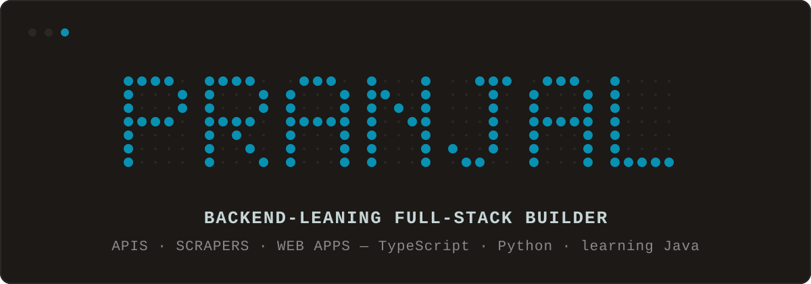
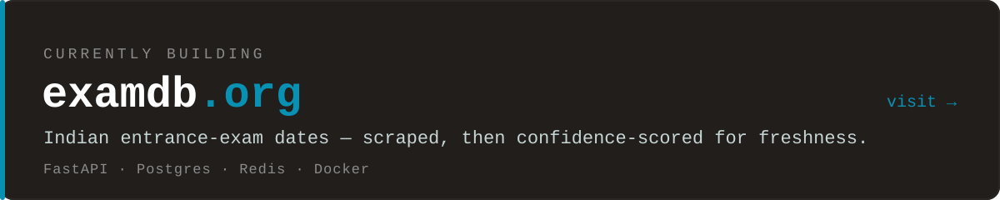

<!-- ╔══════════════════════════════════════════════════════════════════════╗ -->
<!-- ║                              HEADER                                   ║ -->
<!-- ╚══════════════════════════════════════════════════════════════════════╝ -->

<div align="center">



</div>

<!-- ╔══════════════════════════════════════════════════════════════════════╗ -->
<!-- ║                          PROOF · EXAMDB                              ║ -->
<!-- ╚══════════════════════════════════════════════════════════════════════╝ -->

<div align="center">

<a href="https://examdb.org"></a>

</div>

<!-- ╔══════════════════════════════════════════════════════════════════════╗ -->
<!-- ║                              ABOUT                                    ║ -->
<!-- ╚══════════════════════════════════════════════════════════════════════╝ -->


```yaml
name:       Pranjal
role:       full-stack developer · backend-leaning
focus:      examdb.org · APIs & scrapers · web apps · backend infra
learning:   Java ☕
open_to:    collaboration — just reach out
runtime_of_choice: Bun ⚡
```

<!-- ╔══════════════════════════════════════════════════════════════════════╗ -->
<!-- ║                              STACK                                    ║ -->
<!-- ╚══════════════════════════════════════════════════════════════════════╝ -->


<div align="center">

`primary`


`secondary`


</div>

<!-- ╔══════════════════════════════════════════════════════════════════════╗ -->
<!-- ║                        CONTRIBUTION SNAKE                            ║ -->
<!-- ╚══════════════════════════════════════════════════════════════════════╝ -->


<div align="center">

<picture>
<source media="(prefers-color-scheme: dark)" srcset="https://raw.githubusercontent.com/Pranjal-SB/Pranjal-SB/output/snake-dark.svg" />
<source media="(prefers-color-scheme: light)" srcset="https://raw.githubusercontent.com/Pranjal-SB/Pranjal-SB/output/snake.svg" />

</picture>

</div>

<!-- ╔══════════════════════════════════════════════════════════════════════╗ -->
<!-- ║                            SOCIALS                                   ║ -->
<!-- ╚══════════════════════════════════════════════════════════════════════╝ -->


<div align="center">

<a href="https://psbhatnagar.in"></a>
<a href="https://psb.bearblog.dev"></a>
<a href="https://examdb.org"></a>
<a href="https://www.linkedin.com/in/pranjalsb/"></a>
<a href="https://github.com/Pranjal-SB"></a>
<a href="mailto:psbhatnagar.in@gmail.com"></a>

<br><br>

<a href="https://www.instagram.com/psbhatnagarin/"></a>
<a href="https://www.chess.com/member/psbhatnagar"></a>
<a href="https://open.spotify.com/user/317miylx2vtzzljp526chz6nzoc4"></a>

</div>
